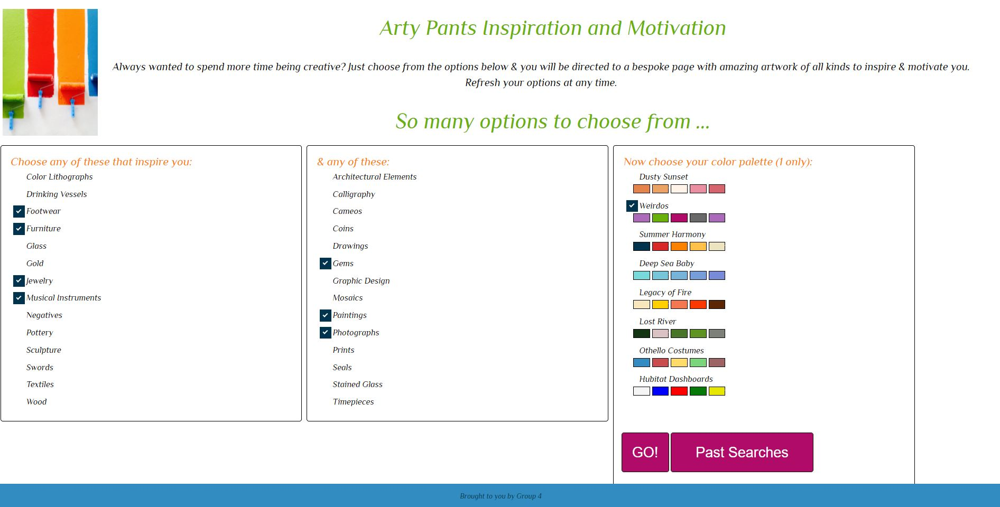
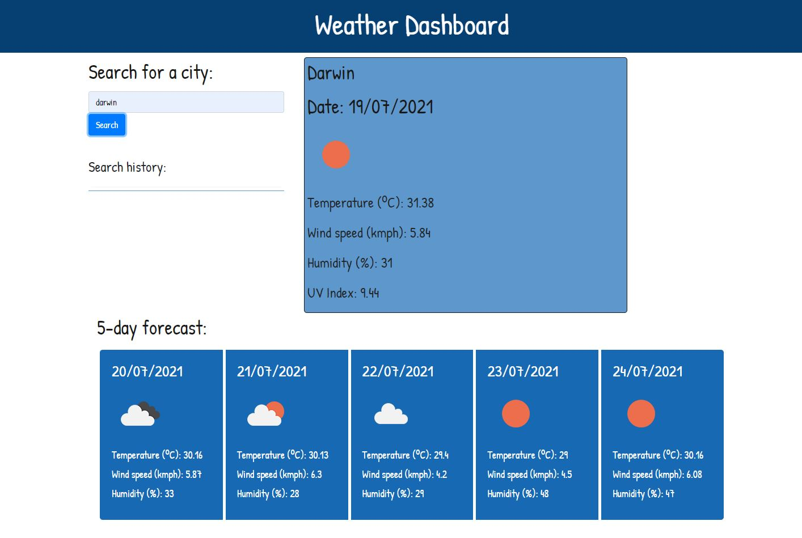

# my-new-updated-portfolio
BOOTCAMP - Week 16 assignment


[](https://opensource.org/licenses/MIT)

## User Story

```
AS A upcoming web developer
I WANT to showcase my portfolio of deployed work samples
SO THAT I can present the best examples of my work so a potential employer can assess whether I am a good candidate for a position they have available
```

## Description
My motivation for undertaking this project was to update my portfolio with recent web development work.  It is to use as an adjunct to my resume, giving me the ability to present the best examples of my coding work.  It was also a good chance to refactor my code, where possible, & to give it a better appearance in multiple screen sizes.

## Installation
Open the (index.html) page in your prefered browser to see the finished webpage which is responsive so can be viewed on a number of different screen sizes.

## Usage
Click on the images to be directed to examples of my work.

## Projects featured
### Title: Arty Pants group project
* Alternative title: creating-art
* The URL of the deployed application:  https://rachel-brain.github.io/creating-art/
* The URL of the GitHub repository:     https://github.com/rachel-brain/creating-art
* Screenshot:


### Title: Weather Dashboard
* Alternative title: city-weather-dashboard
* The URL of the deployed application:  https://rachel-brain.github.io/city-weather-dashboard/
* The URL of the GitHub repository:     https://github.com/rachel-brain/city-weather-dashboard
* Screenshot:


### Title: Gotta Keep 'em Generated
* Alternative title: generate-passwords
* The URL of the deployed application:  https://rachel-brain.github.io/generate-passwords/
* The URL of the GitHub repository:     https://github.com/rachel-brain/generate-passwords
* Screenshot:


### Title: Workday Scheduler
* Alternative title: handy-workday-scheduler
* The URL of the deployed application:  https://rachel-brain.github.io/handy-workday-scheduler/
* The URL of the GitHub repository:     https://github.com/rachel-brain/handy-workday-scheduler
* Screenshot:


## Screenshot
.

## License
The MIT License has been applied which can be seen in the source file at (LICENSE.txt).

## Tests
The main test run was to look at the site in multiple screen sizes, using the toggle device bar in the Dev Tools in the browser.  Despite using Bootstrap v5.0 this time, at the time of publishing, the site was still not perfect in all screen sizes & further debugging is required.  In particular, the navbar was not always visible and the images were not always showing in full.

## URLs
* The URL of the deployed application:  https://rachel-brain.github.io/my-new-improved-portfolio/
* The URL of the GitHub repository:     https://github.com/rachel-brain/my-new-improved-portfolio